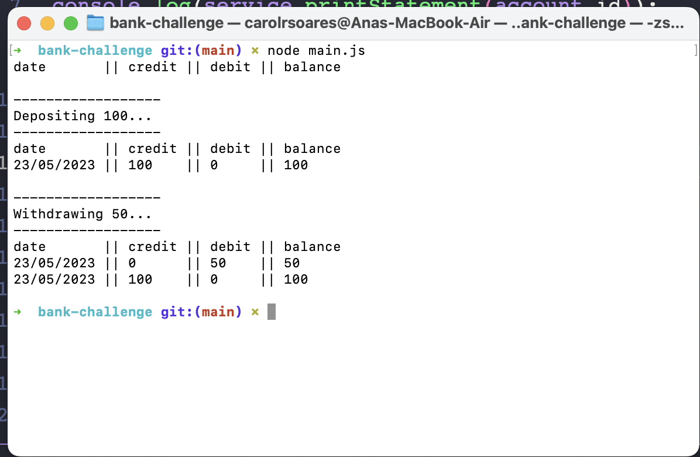

# Bank-Tech-Test

This program is a simple banking system implemented in Node.js. It allows you to create accounts, perform deposits and withdrawals, and generate a statement of transactions for a given account.

# File Structure

The program consists of the following files:

model/account.js: Defines the Account class, representing a bank account. It has properties such as id (account ID), balance (account balance), and transactions (an array of transactions associated with the account).

model/transaction.js: Defines the Transaction class, representing a single transaction. It has properties such as credit (amount credited), debit (amount debited), amount (current balance after the transaction), and date (date of the transaction). It also includes a formatDate method to format the date in the desired format.

repository/account_repo.js: Defines the AccountRepository class, which is responsible for managing the storage and retrieval of accounts. It uses a Map to store the accounts and provides methods to create a new account, find an account by ID, and update an existing account.

services/account.js: Defines the AccountService class, which acts as the main service for account-related operations. It takes an instance of AccountRepository as a dependency and provides methods for creating accounts, depositing funds, withdrawing funds, and generating a statement of transactions for an account.

# Usage

To use this program, you need to have Node.js installed on your system.

Copy the provided code into separate files with the same names as mentioned above.
Install the required dependencies by running the following command in the terminal:

```
npm install
```

Now you can use the program by importing the necessary classes and creating instances of AccountService and AccountRepository as shown in the examples below:

```
const AccountService = require('./services/account');
const AccountRepository = require('./repository/account_repo');

// Create an instance of AccountRepository
const accountRepository = new AccountRepository();

// Create an instance of AccountService with the AccountRepository instance
const accountService = new AccountService(accountRepository);

// Example usage: Create a new account
const account = accountService.create();
console.log(account);
// Output: Account { id: 12345, balance: 0, transactions: [] }

// Example usage: Deposit funds
accountService.deposit(account.id, 1000, new Date());
console.log(account); 
// Output: Account { id: 12345, balance: 1000, transactions: [ Transaction { credit: 1000, debit: 0, amount: 1000, date: 2023-05-23T00:00:00.000Z } ] }

// Example usage: Withdraw funds
accountService.withdraw(account.id, 500, new Date());
console.log(account); 
// Output: Account { id: 12345, balance: 500, transactions: [ Transaction { credit: 1000, debit: 0, amount: 1000, date: 2023-05-23T00:00:00.000Z }, Transaction { credit: 0, debit: 500, amount: 500, date: 2023-05-23T00:00:00.000Z } ] }

// Example usage: Generate statement
const statement = accountService.printStatement(account.id);
console.log(statement);
// Output:
// date || credit || debit || balance
// 23/05/2023 || 1000 || 0

```

# Run tests:

```
jest
```

# Statement print:



